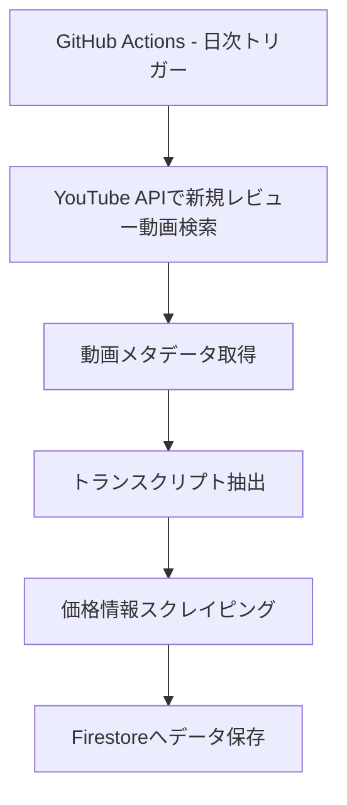
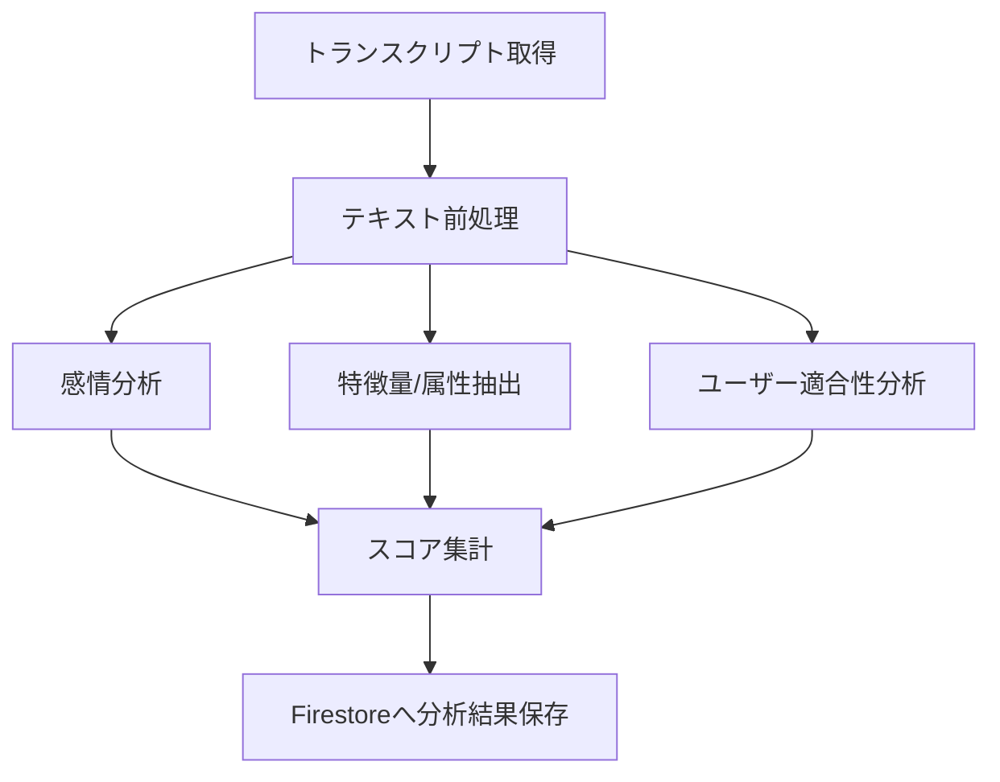
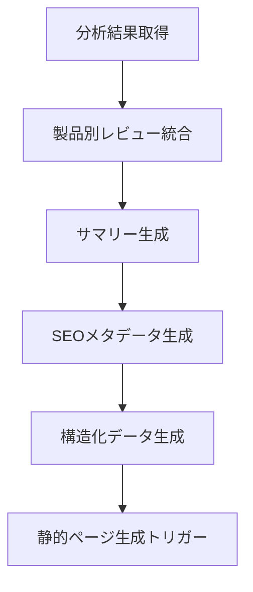
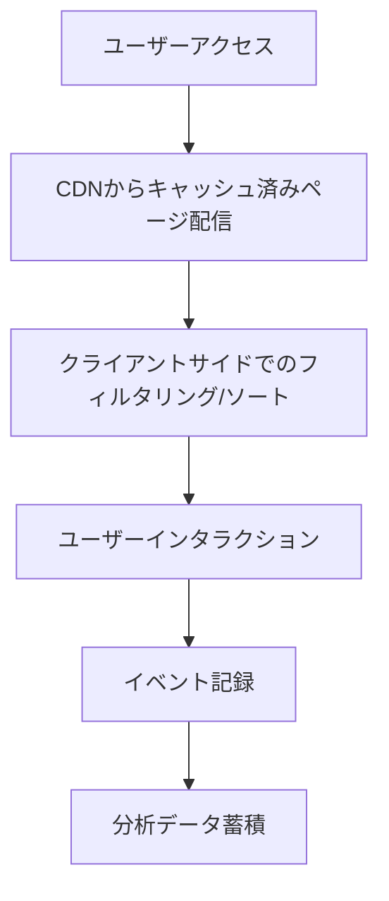

# AIレビュー動画分析サイト - システム設計仕様書

## 1. システム概要

AIレビュー動画分析サイトは、YouTube上の製品レビュー動画を自動的に収集・分析し、ユーザーに統合された製品評価情報を提供するプラットフォームです。初期段階ではキャンプ用品・自動車カテゴリからスタートし、将来的に様々な製品カテゴリへ拡張可能な設計となっています。

### 1.1 主要な目的

- YouTube上の製品レビュー動画からデータを自動収集
- AI技術を活用した動画コンテンツの分析と要約
- 製品評価の統合・可視化によるユーザーの購買判断支援
- 収益化のためのアフィリエイトリンク提供

### 1.2 ターゲットユーザー

- 製品購入前の情報収集をしているユーザー
- 複数の製品を比較検討しているユーザー
- 特定カテゴリの製品に関する最新トレンドを知りたいユーザー

## 2. システムアーキテクチャ

### 2.1 全体アーキテクチャ

本システムはサーバーレスアーキテクチャを採用し、無料枠での運用を前提に設計されています。主要なコンポーネントは以下の通りです：

- **フロントエンド**: Next.js による静的サイト生成（SSG）
- **バックエンド**: Firebase Functions
- **データベース**: Firestore
- **CI/CD**: GitHub Actions
- **ホスティング**: Vercel
- **データ分析**: Hugging Face オープンソースモデル

### 2.2 システム構成図

```
                    +------------------------+
                    |   GitHub Actions      |
                    | (スケジュールタスク)    |
                    +----------+-------------+
                               |
                               v
+---------------+    +--------+---------+    +------------------+
|               |    |                  |    |                  |
| YouTube API   +--->+ Firebase Functions+---> Firestore DB     |
|               |    |                  |    |                  |
+---------------+    +--------+---------+    +------------------+
                               |                     ^
                               v                     |
                     +---------+----------+          |
                     | Hugging Face Models |          |
                     | (感情分析・要約生成) |          |
                     +---------+----------+          |
                               |                     |
                               v                     |
                     +---------+----------+          |
                     |                   |          |
                     | Vercel (Next.js)  +----------+
                     |                   |
                     +-------------------+
                               |
                               v
                     +-------------------+
                     |                   |
                     |   エンドユーザー   |
                     |                   |
                     +-------------------+
```

## 3. 技術スタックと選定理由

### 3.1 フロントエンド: Next.js

**選定理由**:
- SSG（Static Site Generation）による高速ページロード
- SEO対策の容易さ
- React コンポーネントの再利用性
- Vercel との統合によるデプロイの簡便さ
- ISR（Incremental Static Regeneration）によるデータ更新の柔軟性

### 3.2 バックエンド: Firebase Functions

**選定理由**:
- サーバーレスで運用コストを抑制
- スケーラビリティ
- 無料枠の範囲内で十分な処理が可能
- Firebase エコシステムとの統合
- イベント駆動型アーキテクチャの実現

### 3.3 データベース: Firestore

**選定理由**:
- NoSQL の柔軟なデータモデリング
- リアルタイム更新機能
- スケーラビリティ
- セキュリティルールによるアクセス制御
- Firebase Functions との親和性

### 3.4 CI/CD: GitHub Actions

**選定理由**:
- 無料で利用可能なワークフロー
- スケジュールタスクの自動実行
- デプロイ自動化
- テスト自動化
- リポジトリと密接に連携

### 3.5 AI: Hugging Face オープンソースモデル

**選定理由**:
- 無料で利用可能な高性能モデル
- カスタマイズ可能性
- 多言語対応
- 継続的な改善とコミュニティサポート
- ローカルでの実行オプション

### 3.6 ホスティング: Vercel

**選定理由**:
- Next.js との親和性
- CDN による高速配信
- 無料枠で十分な性能
- デプロイの簡便さ
- プレビュー環境の自動生成

## 4. 主要プロセスフロー

### 4.1 データ収集フロー



**詳細プロセス**:
1. GitHub Actions が定期的（日次）に実行
2. 製品キーワードと「レビュー」などの検索語を組み合わせてYouTube検索
3. 検索結果から動画ID、タイトル、サムネイル、チャンネル情報などを取得
4. YouTube字幕APIを使用してトランスクリプトを抽出
5. 製品名で価格比較サイトをスクレイピング
6. 収集したデータをFirestoreに保存

### 4.2 データ分析フロー



**詳細プロセス**:
1. 保存されたトランスクリプトを取得
2. テキストクリーニングと前処理
3. Hugging Face感情分析モデルで評価スコアリング
4. 属性抽出モデルでメリット/デメリット識別
5. ユーザー層別の適合性スコア計算
6. 各分析結果の統合
7. Firestoreへ分析結果保存

### 4.3 コンテンツ生成フロー



**詳細プロセス**:
1. 複数動画の分析結果を製品別に集約
2. AI要約モデルで統合サマリー生成
3. タイトル、メタディスクリプション最適化
4. Schema.org準拠のJSON-LD生成
5. Vercel Webhookで静的ページ再生成トリガー

### 4.4 フロントエンド表示フロー



**詳細プロセス**:
1. ユーザーがサイトにアクセス
2. Vercel CDNが最適化された静的ページを配信
3. クライアントサイドでリアクティブなフィルタリング/ソートを実行
4. ユーザーの操作に応じたコンテンツ表示
5. インタラクションデータの記録
6. 今後の改善のためのデータ蓄積

## 5. 機能要件

### 5.1 コア機能

| 機能 | 説明 | 優先度 |
|------|------|--------|
| レビュー動画検索 | YouTube APIを使用した最新レビュー動画の自動検索 | 高 |
| トランスクリプト抽出 | 動画字幕からのテキスト抽出 | 高 |
| 感情分析 | レビュー内容のポジティブ/ネガティブ分析 | 高 |
| 属性抽出 | メリット/デメリットの抽出と分類 | 高 |
| 製品情報統合 | 複数レビューからの情報統合 | 高 |
| 製品比較 | 複数製品の特徴比較 | 中 |
| 価格追跡 | 複数ストアの価格情報収集と履歴表示 | 中 |
| レビュアー信頼性スコア | チャンネル評価による重み付け | 低 |

### 5.2 非機能要件

| 要件 | 説明 | 目標値 |
|------|------|--------|
| パフォーマンス | ページロード時間 | < 2秒 |
| SEO最適化 | 主要キーワードでの検索順位 | 上位10位以内 |
| モバイル対応 | レスポンシブデザイン | すべてのビューポート対応 |
| アクセシビリティ | WCAG 2.1準拠レベル | AA |
| セキュリティ | データアクセス制御 | 適切なFirebaseセキュリティルール |
| スケーラビリティ | 無料枠でのカテゴリ拡張性 | 〜10カテゴリ程度 |

## 6. データモデル

### 6.1 主要データモデル

```javascript
// 製品モデル
{
  id: String,                 // 製品ユニークID
  name: String,               // 製品名
  category: String,           // カテゴリ (例: "camping")
  subCategory: String,        // サブカテゴリ (例: "tent")
  images: Array<String>,      // 画像URL配列
  summary: {                  // AI生成サマリー
    positives: Array<String>, // 長所リスト
    negatives: Array<String>, // 短所リスト
    bestFor: Array<String>,   // 最適な使用シナリオ
    score: Number,            // 総合評価スコア (0-100)
  },
  specs: Object,              // 仕様情報 (製品により異なる)
  prices: [{                  // 価格情報
    store: String,            // ストア名 (例: "Amazon")
    price: Number,            // 価格
    currency: String,         // 通貨コード (例: "JPY")
    url: String,              // 商品ページURL
    lastUpdated: Timestamp,   // 最終更新日時
  }],
  videos: [{                  // 関連レビュー動画
    id: String,               // 動画ID
    platform: String,         // プラットフォーム (例: "youtube")
    title: String,            // 動画タイトル
    channelName: String,      // チャンネル名
    url: String,              // 動画URL
    thumbnailUrl: String,     // サムネイルURL
    publishedAt: Timestamp,   // 公開日時
    viewCount: Number,        // 視聴回数
    sentiment: Number,        // 感情分析スコア (-1.0〜1.0)
  }],
  lastUpdated: Timestamp,     // データ最終更新日時
  trending: Boolean,          // トレンド商品フラグ
  rank: Number                // カテゴリ内ランキング
}

// カテゴリモデル
{
  id: String,                 // カテゴリID
  name: String,               // カテゴリ名
  description: String,        // カテゴリ説明
  imageUrl: String,           // カテゴリ画像
  subCategories: [{           // サブカテゴリ
    id: String,               // サブカテゴリID
    name: String,             // サブカテゴリ名
  }],
  searchKeywords: Array<String>, // 検索キーワード
  productCount: Number,       // 製品数
  lastUpdated: Timestamp      // 最終更新日時
}

// トランスクリプトモデル
{
  videoId: String,            // YouTube動画ID
  language: String,           // 言語コード
  fullText: String,           // 完全なトランスクリプト
  segments: [{                // セグメント
    startTime: Number,        // 開始時間（秒）
    endTime: Number,          // 終了時間（秒）
    text: String,             // テキスト
  }],
  analyzedData: {             // 分析結果
    sentiment: Number,        // 感情スコア
    keywords: Array<String>,  // キーワード
    entities: Array<Object>,  // 抽出エンティティ
    topics: Array<String>,    // トピック
    features: Object,         // 製品特徴
  },
  productId: String,          // 関連製品ID
  lastUpdated: Timestamp      // 最終更新日時
}
```

### 6.2 Firestore コレクション構造

```
firestore/
├── products/                 # 製品コレクション
│   ├── {productId}/          # 製品ドキュメント
│   │   └── videos/           # 製品関連動画サブコレクション
│   │       └── {videoId}     # 動画ドキュメント
├── categories/               # カテゴリコレクション
│   └── {categoryId}/         # カテゴリドキュメント
├── transcripts/              # トランスクリプトコレクション
│   └── {videoId}/            # 動画トランスクリプト
├── prices/                   # 価格履歴コレクション
│   └── {productId}/          # 製品価格履歴
│       └── {storeId}/        # ストア別価格履歴
└── analytics/                # 分析データコレクション
    └── {entityId}/           # 分析対象エンティティ
```

## 7. API設計

### 7.1 Firebase Functions API エンドポイント

| エンドポイント | 機能 | メソッド | アクセス制限 |
| -------------- | ---- | -------- | ------------ |
| `/api/products` | 製品一覧取得 | GET | 公開 |
| `/api/products/:id` | 製品詳細取得 | GET | 公開 |
| `/api/products/category/:id` | カテゴリ別製品取得 | GET | 公開 |
| `/api/products/compare` | 製品比較 | POST | 公開 |
| `/api/admin/products` | 製品追加/更新 | POST/PUT | 認証必須 |
| `/api/admin/products/:id` | 製品削除 | DELETE | 認証必須 |
| `/api/webhooks/revalidate` | キャッシュ再検証 | POST | APIキー |
| `/api/search` | 製品検索 | GET | 公開 |

### 7.2 YouTube API 利用

| API | 用途 | クォータ消費 |
| --- | ---- | ------------ |
| `youtube.search.list` | レビュー動画検索 | 100単位/リクエスト |
| `youtube.videos.list` | 動画詳細取得 | 1単位/リクエスト |
| `youtube.captions.download` | 字幕取得 | 3単位/リクエスト |
| `youtube.channels.list` | チャンネル情報取得 | 1単位/リクエスト |

## 8. セキュリティ設計

### 8.1 認証・認可

- Firebase Authentication を使用した管理者認証
- JWT トークンによるAPI認証
- Firestore セキュリティルールによるデータアクセス制限

### 8.2 データ保護

- センシティブ情報の暗号化
- バックアップ戦略
- GDPR/個人情報保護法コンプライアンス

### 8.3 API セキュリティ

- レート制限の実装
- CORS 設定
- API キーローテーション

## 9. パフォーマンス最適化

### 9.1 フロントエンド最適化

- 画像最適化（WebP、サイズ最適化）
- コード分割とレイジーローディング
- キャッシング戦略
- Web Vitals 最適化

### 9.2 バックエンド最適化

- 増分更新によるデータ処理
- バッチ処理の実装
- クエリ最適化
- インデックス設計

### 9.3 コスト最適化

- YouTube API クォータ管理
- Firebase 無料枠最大活用戦略
- キャッシング活用による読み取り削減

## 10. モニタリングと分析

### 10.1 システムモニタリング

- Firebase Performance Monitoring
- Sentry エラートラッキング
- ログ記録戦略

### 10.2 ユーザー分析

- Google Analytics 設定
- コンバージョントラッキング
- ユーザーフロー分析

## 11. 拡張性計画

### 11.1 短期拡張計画

- 初期カテゴリ展開（キャンプ用品、自動車）
- ユーザーフィードバック機能追加
- SEO最適化フェーズ

### 11.2 中期拡張計画

- 新カテゴリ追加フレームワーク確立
- AIモデル精度向上
- ユーザーパーソナライゼーション

### 11.3 長期拡張計画

- モバイルアプリ展開
- マネタイズ戦略拡大
- コミュニティ機能追加

## 12. テスト戦略

### 12.1 単体テスト

- Jest フレームワーク使用
- コンポーネントテスト
- ユーティリティ関数テスト

### 12.2 統合テスト

- Firebase エミュレータ使用
- APIエンドポイントテスト
- データ処理パイプラインテスト

### 12.3 E2Eテスト

- Cypress による自動テスト
- ユーザーフロー検証
- デバイス互換性検証

## 13. デプロイ戦略

### 13.1 環境設定

- 開発環境
- ステージング環境
- 本番環境

### 13.2 CI/CDパイプライン

- GitHub Actions ワークフロー
- 自動テスト実行
- 条件付きデプロイ

### 13.3 デプロイプロセス

- フロントエンド: Vercel へのデプロイ
- バックエンド: Firebase Functions デプロイ
- データベース: Firestore セキュリティルールデプロイ

## 14. 法的考慮事項

### 14.1 コンテンツ引用

- YouTube コンテンツの適正な引用範囲
- 著作権法遵守

### 14.2 アフィリエイト表示

- アフィリエイト広告ガイドライン遵守
- 収益開示

### 14.3 プライバシー対応

- プライバシーポリシー
- クッキーポリシー
- データ保持ポリシー
